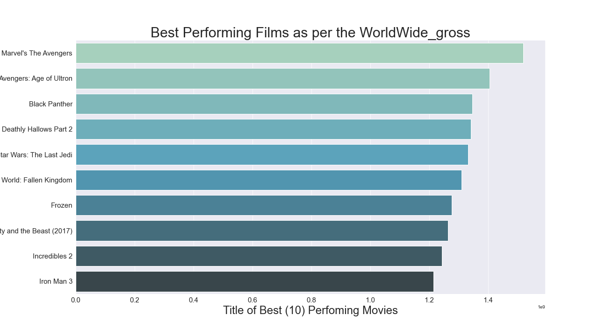
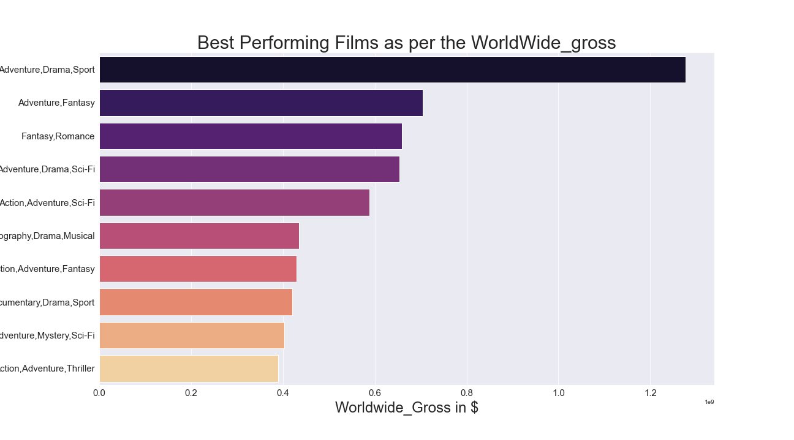
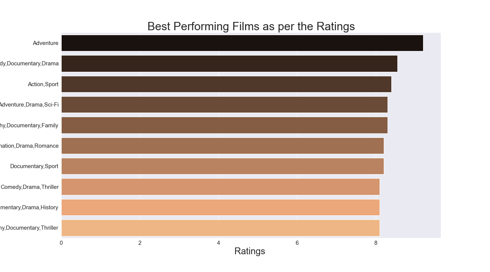
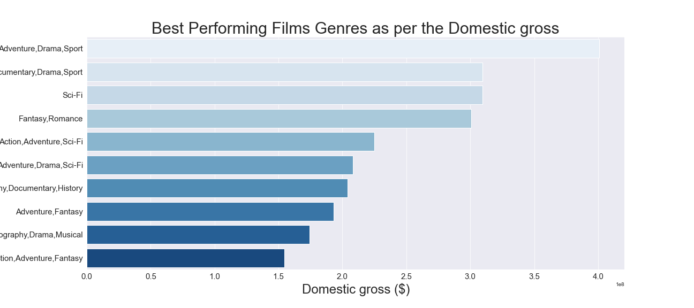
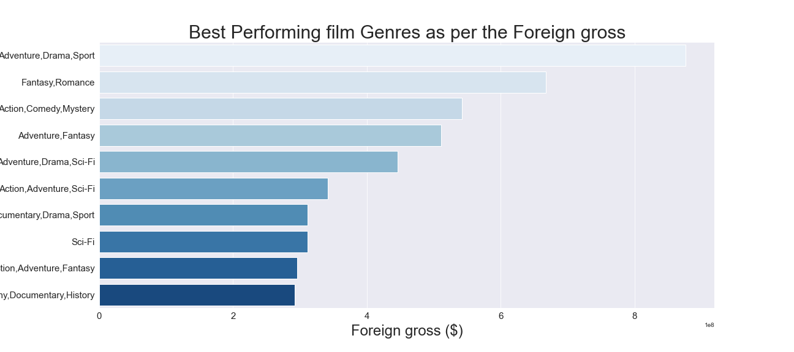
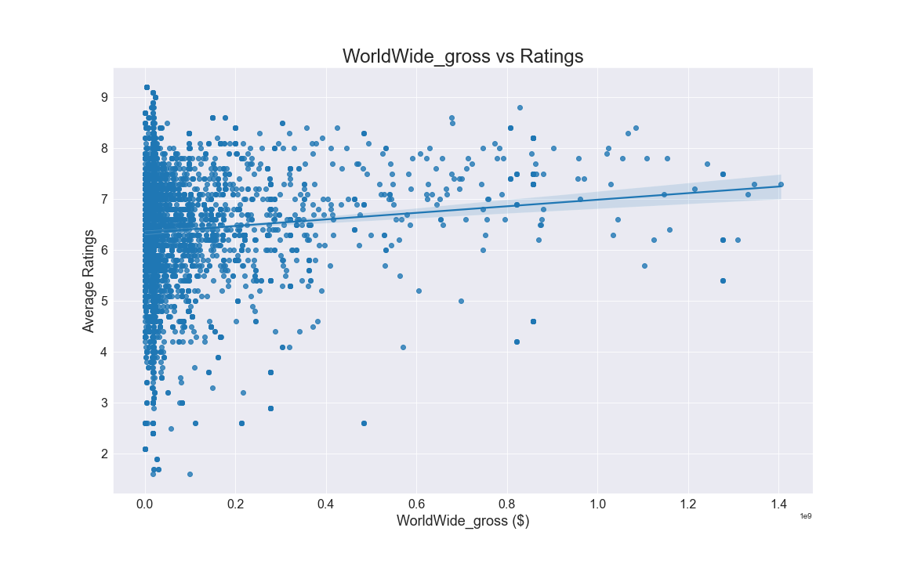
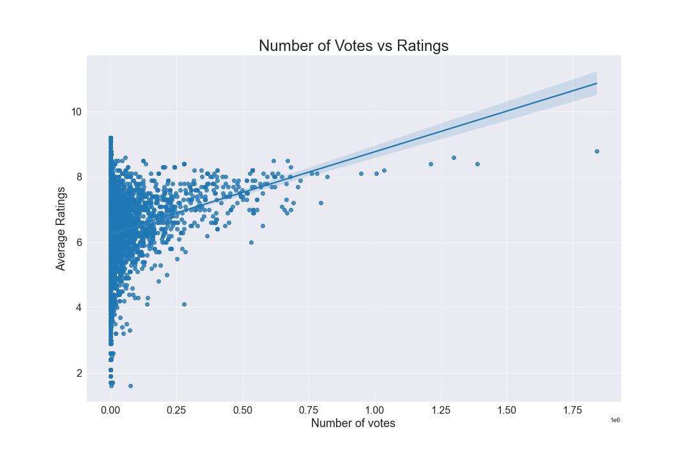
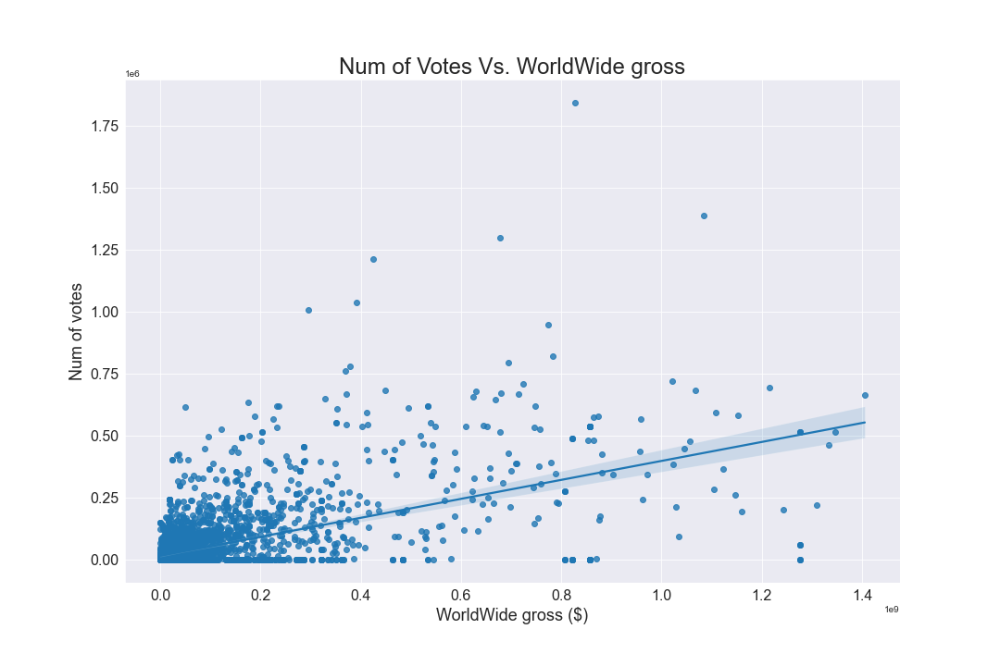

#                          Project Movies Analysis
## Project overview

For this project, you will use exploratory data analysis to generate insights for a business stakeholder.

## Business Problem

Microsoft sees all the big companies creating original video content and they want to get in on the fun. They have decided to create a new movie studio, but they don’t know anything about creating movies. You are charged with exploring what types of films are currently doing the best at the box office. You must then translate those findings into actionable insights that the head of Microsoft's new movie studio can use to help decide what type of films to create.

## Objectives

1. Importing the required libraries

2. Loading Data from the files

3. Data understanding by analysing the data

4. Data Cleaning and handling of NAN values in the datasets

5. Data Visualisation 

## Sources of My Datasets

1. imdb.title.basics

2. imdb.title.ratings

3. bom.movie_gross

## Importing Libraries

. Importing and alias Pandas as pd

. Import and alias matplotlib.pyplot as plt

. Import and alias seaborn as sns

## Data Understanding

### Loading Data

bom_df = pd.read_csv("bom.movie_gross.csv",index_col=0)

Title_df = pd.read_csv("imdb.title.basics.csv", index_col=0)

Ratings_df = pd.read_csv("imdb.title.ratings.csv.gz",index_col=0)

## Data Cleaning

 Identifying and handling NAN values 

 Replacing NAN values with median() for the numerical data 

 Replacing NAN values with a descriptive word 'Missing' 

## Data Visualization

###  Question 1: What films are currently doing best at box office?

### Question 2: What Genres of films are currently doing best at box office?

#### I : In terms of Worldwide Gross income

#### II : In terms of Ratings

Analysis of the top 20 performing genres in relation to their ratings

### Question 3: What is the relationship between genres and foreign and domestic gross income?

#### I. Domestic gross vs genres

#### II. Foreign gross vs genres

### Question 4: What is the relationship between Worldwide gross income and Ratings

pearsoncorr = budget_Title_Ratings_df.corr(method='pearson')

There is weak positive correlation between WorldWide gross and average rating of 0.059501
	

This shows a weak positive correlation as the average rating increases the WorldWide gross may increase or it may not increase and the trend line is slightly positive

### Question 5: What is the relationship between number of votes and the average rating

pearsoncorr_2 = budget_Title_Ratings_df.corr(method='pearson')

There is a weak positive correlation between the num of votes and the average rating of the movies of 0.242963

There is a positive correlation between Number of votes and the average ratings of the movie and the trend line is positive

### Question 6: What is the relationship between the number of votes and the WorldWide gross?

earsoncorr_3 = budget_Title_Ratings_df.corr(method='pearson')

There is a positive correlation between the number of votes and the Worldwide gross of 0.569319

There is a positive correlation between the num of votes and the WorldWide gross as the trend line is positive

## Summary

While there are many other factors that we could consider in a future analysis we feel that the following conclusions will result in a successful business venture as Microsoft enters the movie industry.
